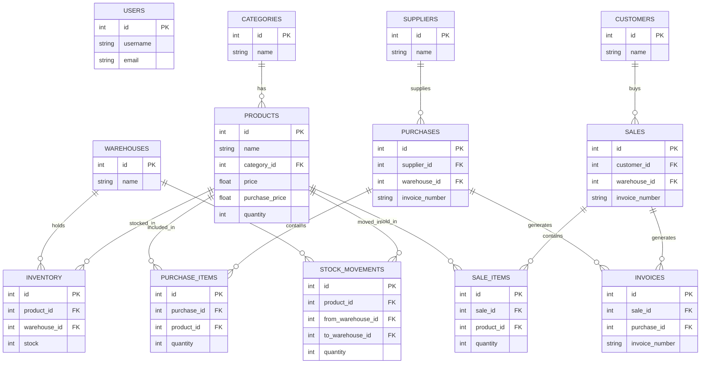

# Inventory Management — Project Documentation

## Project Overview

- Purpose: Inventory and warehouse management system (Fly Ash Bricks ERP) with backend API (FastAPI + SQLAlchemy) and frontend admin UI (Next.js + React).
- Main responsibilities:
  - Track products, warehouses, inventory, purchases, and sales
  - Manage suppliers, customers, users, and activity logs
  - Generate reports, invoices, and backups

## Architecture Summary

- Backend: FastAPI application located in `backend/` that exposes a REST API. Key files:
  - `backend/main.py` — app startup, static mounting, DB table creation
  - `backend/routes.py` — all API endpoints and business logic
  - `backend/models.py` — SQLAlchemy ORM models and relations
  - `backend/schemas.py` — Pydantic request/response models
  - `backend/database.py` — DB engine configuration and session utilities

- Frontend: Next.js app inside `frontend/` using App Router. Key areas:
  - `frontend/app/` — pages (dashboard, products, purchases, sales, reports, etc.)
  - `frontend/components/` — reusable components (Sidebar, Navbar, forms like SupplierForm)
  - `frontend/services/api.js` — axios wrapper for calling backend APIs

- Data storage: SQL database via SQLAlchemy. The project supports SQLite (development) and PostgreSQL (production) if environment variables are configured in `backend/database.py`.

## How the Project Flows (High level)

1. Frontend UI calls backend REST API for CRUD operations (products, inventory, purchases, sales).
2. Backend enforces business logic in `routes.py`, updates DB via SQLAlchemy models (`models.py`).
3. Inventory updates create `StockMovement` records and update aggregated `Product.quantity`.
4. Actions are audited via `ActivityLog` and low-stock alerts are created as `Notification` rows.
5. Frontend displays data, charts (Chart.js), and allows exporting backups via `/backup` API.

## Database Schema (ER Diagram)

Below is a simplified ER diagram (Mermaid) representing main entities and relations.



> Note: This diagram is derived from `backend/models.py` and shows the primary foreign key relations.

## Use Case Diagram

```mermaid
usecaseDiagram
    actor Admin as A

    A --> (Manage Products)
    A --> (Manage Categories)
    A --> (Manage Warehouses)
    A --> (Manage Inventory)
    A --> (Create Purchase)
    A --> (Create Sale)
    A --> (Manage Suppliers)
    A --> (Manage Customers)
    A --> (Generate Reports)
    A --> (Backup Data)
    A --> (View Notifications)
```

## Key Backend APIs (Summary)

All endpoints are prefixed by the main router in `backend/routes.py`.

- Auth & Profile
  - POST `/register` — register new admin
  - POST `/login` — login and receive bearer token
  - GET `/me` — get current user
  - PUT `/me` — update username/email
  - PUT `/me/change-password` — change password

- Categories
  - GET `/categories`
  - POST `/categories`
  - PUT `/categories/{id}`
  - DELETE `/categories/{id}`

- Products
  - GET `/products` (filters: category_id, status, search)
  - POST `/products`
  - PUT `/products/{id}`
  - DELETE `/products/{id}`
  - POST `/products/{id}/image` (file upload)

- Warehouses
  - GET `/warehouses`
  - POST `/warehouses`
  - PUT `/warehouses/{id}`
  - DELETE `/warehouses/{id}`

- Inventory
  - GET `/inventory` (filters: warehouse_id, product_id)
  - POST `/inventory`
  - PUT `/inventory/{id}`
  - DELETE `/inventory/{id}`
  - POST `/inventory/transfer` — move stock between warehouses
  - POST `/inventory/adjust` — manual adjustment

- Suppliers & Customers
  - CRUD for `/suppliers` and `/customers` (GET, POST, PUT, DELETE)

- Purchases
  - GET `/purchases` and GET `/purchases/{id}`
  - POST `/purchases` — creates purchase, updates inventory, creates invoice
  - DELETE `/purchases/{id}` — reverses stock and deletes purchase

- Sales
  - GET `/sales` and GET `/sales/{id}`
  - POST `/sales` — validates stock, deducts inventory, creates invoice
  - DELETE `/sales/{id}` — restores stock and deletes sale

- Reports & Dashboard
  - GET `/dashboard` or `/reports/dashboard`
  - GET `/reports/inventory`
  - GET `/reports/warehouses`
  - GET `/reports/*` — other reports under `frontend` usage

- Notifications & Activity
  - GET `/notifications`, PUT `/notifications/{id}/read`, PUT `/notifications/read-all`
  - GET `/activity-logs`

- Invoices & Backup
  - GET `/invoices`
  - POST `/backup` — exports key tables to `static/backups/*.json`

> See `backend/routes.py` for exact payload schemas and more details.

## Pydantic Schemas & Validation

- The `backend/schemas.py` file defines request/response models for each endpoint and enforces validations such as email and phone patterns. Phone fields are validated as exactly 10 digits in both backend and frontend.

## Frontend Structure & Components

- Pages (app router): see `frontend/app/` for top-level pages: dashboard, products, purchases, sales, reports, suppliers, customers, warehouses, login, register, profile.
- Components: `frontend/components/` contains shared UI parts such as `Sidebar.js`, `Navbar.js`, `ProductForm.js`, `SupplierForm.js`, `CategoryForm.js`.
- API client: `frontend/services/api.js` wraps axios and handles base URL + token header injection.

Relevant files:
- `frontend/app` — pages (e.g. `frontend/app/products/page.js`)
- `frontend/components` — UI components (e.g. `frontend/components/SupplierForm.js`)
- `frontend/services/api.js` — API helper

## How To Run (Development)

Backend (Python, FastAPI):

1. Create a virtual environment and install dependencies (if you have a `requirements.txt`, prefer that):

```powershell
python -m venv .venv
.\.venv\Scripts\Activate.ps1
pip install -r requirements.txt
# OR if no requirements.txt
pip install fastapi uvicorn sqlalchemy pydantic python-multipart psycopg2-binary alembic
```

2. Start the backend from `backend/`:

```powershell
cd backend
uvicorn main:app --reload --host 0.0.0.0 --port 8000
```

3. Health check: `http://localhost:8000/health`

Frontend (Next.js):

```powershell
cd frontend
npm install
npm run dev
# App will be available at http://localhost:3000
```

## Environment & Database Notes

- `backend/database.py` chooses PostgreSQL when environment variables are fully configured; otherwise it falls back to a local SQLite DB (development). Check `backend/database.py` for `DATABASE_URL` selection logic.
- When using PostgreSQL, set `DB_HOST`, `DB_PORT`, `DB_NAME`, `DB_USER`, `DB_PASSWORD` environment variables.

## Development Tips & Workflow

- Use the backend `--reload` flag for auto-reloads.
- Seed data: create categories, products, warehouses first before adding inventory, purchases, or sales.
- Use API client (`frontend/services/api.js`) with bearer token from login to test protected endpoints.
- When changing models, run database migrations (project currently uses SQLAlchemy models + `Base.metadata.create_all`, consider adopting Alembic for production migrations).

## Files to Inspect (Quick links)

- `backend/main.py` ([backend/main.py](backend/main.py))
- `backend/routes.py` ([backend/routes.py](backend/routes.py))
- `backend/models.py` ([backend/models.py](backend/models.py))
- `backend/schemas.py` ([backend/schemas.py](backend/schemas.py))
- `backend/database.py` ([backend/database.py](backend/database.py))
- `frontend/app` ([frontend/app](frontend/app))
- `frontend/components` ([frontend/components](frontend/components))

## Next Steps & Suggestions

- Add a `requirements.txt` and a Docker Compose configuration for Postgres + app for reproducible runs.
- Add Alembic for safe schema migrations instead of `create_all`.
- Add automated API documentation generation (FastAPI already exposes OpenAPI at `/docs`).
- Expand diagrams into a dedicated `docs/diagrams/` folder as PNG/SVG exports if you want offline viewing.

---

This documentation is a starting point; I can now:
- Expand the API Reference into a complete endpoint-by-endpoint spec with request/response examples.
- Export the Mermaid diagrams to SVG/PNG and save them under `docs/diagrams/`.
- Create a `requirements.txt` based on your environment.

Which of these would you like next?